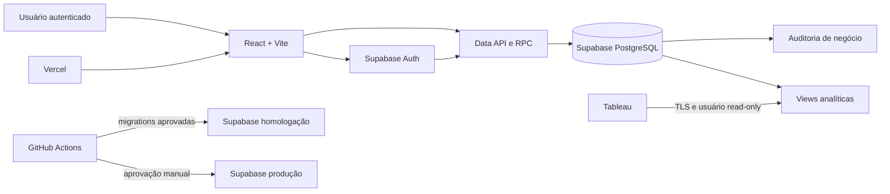

# Arquitetura da plataforma LTC-M

## Estado da decisão

| Campo    | Valor                                                        |
| -------- | ------------------------------------------------------------ |
| Tarefa   | 0.07                                                         |
| Estado   | Aprovada para a fundação técnica                             |
| Data     | 2026-07-27                                                   |
| Registro | [ADR-0001](adr/0001-arquitetura-base-da-plataforma-ltc-m.md) |

Esta página descreve a arquitetura vigente. O ADR registra as alternativas e justificativas que
levaram à decisão. A especificação funcional permanece em
[`project-specification.md`](project-specification.md).

Esta decisão não aprova o modelo de dados nem resolve conceitos financeiros pendentes. Nenhuma
migration de domínio deve ser criada até que as regras correspondentes sejam confirmadas.

## Princípios

- PostgreSQL é a fonte de verdade para dados e regras que exigem integridade ou atomicidade.
- Autorização é aplicada no banco com menor privilégio e negação por padrão.
- Ambientes e credenciais são isolados; produção nunca é usada como ambiente de desenvolvimento.
- Schema, políticas, funções e views são promovidos exclusivamente por migrations versionadas.
- Dados financeiros, pessoais e credenciais não aparecem em logs, fixtures ou repositório.
- O frontend pode validar a experiência, mas não é a única barreira para regras críticas.
- Operação, auditoria de negócio e observabilidade técnica são responsabilidades distintas.

## Visão geral



## 1. Frontend e workspace

A stack existente fica confirmada:

- npm workspaces na raiz;
- `apps/web` com React, TypeScript estrito, Vite, Vitest e ESLint;
- Prettier e comandos agregados na raiz;
- `supabase`, `scripts`, `docs` e `tests` como fronteiras explícitas.

React com Vite é suficiente para o CRUD autenticado e permite hospedagem estática. Não há
necessidade atual de SSR, Next.js ou um servidor Node persistente. Um novo pacote em `packages/`
só deve ser criado quando houver código realmente compartilhado; abstrações preventivas não são
parte desta decisão.

A aplicação acessará o Supabase por cliente oficial e chave pública. Operações simples podem usar
a Data API sob RLS. Operações compostas, alterações financeiras, aprovação, versionamento e
controle de concorrência devem chamar funções RPC transacionais. Edge Functions ficam reservadas
para integrações externas, webhooks, tarefas privilegiadas ou processamento que não pertença a
uma transação de banco.

## 2. Backend e banco de dados

Supabase gerenciado com PostgreSQL é a plataforma de backend recomendada para desenvolvimento
remoto, homologação e produção. A stack local do Supabase será usada para desenvolvimento e
testes assim que houver um runtime compatível com Docker.

As responsabilidades são:

- PostgreSQL: modelo relacional, constraints, transações, RLS, RPCs, auditoria e views;
- Supabase Auth: identidade e emissão de JWT;
- Data API: acesso do navegador sob grants e RLS;
- Edge Functions: somente para necessidades server-side que não devem ir ao navegador;
- Storage e Realtime: adotados apenas quando uma tarefa demonstrar necessidade.

O schema `public` é exposto pela Data API e deve conter somente objetos deliberadamente
publicados. Objetos auxiliares de segurança, staging e analytics devem ficar em schemas não
expostos sempre que possível.

## 3. Autenticação e autorização

Supabase Auth será o provedor de identidade. O primeiro ciclo será privado, com cadastro público
desabilitado e usuários criados por convite ou administração. O método inicial recomendado é
e-mail corporativo com link mágico ou senha; SSO corporativo e MFA dependem do provedor de
identidade, plano contratado e política da organização.

Os papéis funcionais previstos são:

- visualizador;
- editor;
- aprovador financeiro;
- administrador.

Esses papéis não substituem os papéis PostgreSQL `anon` e `authenticated`. A associação entre
usuário, papel e escopo será modelada posteriormente e aplicada por políticas RLS. O frontend
pode ocultar ações sem permissão, mas o banco deve rejeitar a operação independentemente da UI.

Claims customizadas no JWT podem reduzir consultas de autorização, mas não serão a fonte única
para permissões mutáveis: tokens permanecem válidos até expirar. A decisão entre consulta a
tabelas de autorização e custom claims deve ser validada com os requisitos de revogação.

## 4. Estratégia de Row Level Security

A política é **RLS obrigatória, menor privilégio e negação por padrão**:

1. habilitar e forçar RLS em todas as tabelas de negócio expostas;
2. não conceder acesso de negócio ao papel `anon`;
3. criar políticas separadas por operação: `SELECT`, `INSERT`, `UPDATE` e `DELETE`;
4. usar `auth.uid()` para identidade e funções de autorização revisadas para papel/escopo;
5. incluir `USING` e `WITH CHECK` em alterações;
6. testar casos permitidos e negados para cada papel;
7. indexar colunas consultadas pelas políticas;
8. revogar execução pública de funções e conceder somente RPCs aprovadas;
9. preferir `security invoker`;
10. quando `security definer` for indispensável, fixar `search_path`, qualificar objetos e limitar
    `EXECUTE`.

Views acessadas pelo navegador devem usar `security_invoker = true` ou permanecer em schema não
exposto. A chave `service_role` ou uma chave secreta nunca pode chegar ao bundle do Vite, pois
contorna RLS.

## 5. Ambientes

| Ambiente                          | Frontend                        | Supabase            | Dados                    | Promoção                          |
| --------------------------------- | ------------------------------- | ------------------- | ------------------------ | --------------------------------- |
| Local                             | Vite em `127.0.0.1:5173`        | CLI + Docker        | Sintéticos               | Manual, local                     |
| Desenvolvimento remoto temporário | Vite ou preview                 | Projeto dev isolado | Sintéticos               | Manual, descartável               |
| Homologação                       | Vercel Preview/ambiente staging | Projeto staging     | Sintéticos ou mascarados | Automática após aprovação técnica |
| Produção                          | Vercel Production               | Projeto production  | Reais                    | Gate manual                       |

Homologação e produção devem ser projetos Supabase distintos, com chaves, senhas, URLs, backups
e limites próprios. Preview do frontend não recebe automaticamente acesso a produção.

## 6. Supabase local com Docker

O fluxo alvo continua:

```bash
npm run db:start
npm run db:status
npm run db:reset
npm run db:stop
```

`db:reset` é permitido somente no ambiente local e reconstrói o banco a partir das migrations e
do seed. A stack local não deve ser exposta à rede pública: ela usa credenciais conhecidas, não
possui endurecimento de produção e serve apenas a desenvolvimento/testes.

Docker Desktop é a opção recomendada no computador atual. Podman ou outro runtime com API
compatível pode ser avaliado se a política de licenciamento ou infraestrutura impedir Docker.

## 7. Alternativa temporária sem Docker

Enquanto não houver runtime de containers, pode ser criado um projeto Supabase gerenciado
exclusivo para desenvolvimento:

- sem dados reais, pessoais ou financeiros;
- sem reutilizar staging ou produção;
- com custo, região e responsável definidos;
- com cadastro público desabilitado;
- com credenciais somente em `.env.local` ou cofre;
- com todas as mudanças registradas como migrations no repositório;
- preferencialmente descartável após a validação local voltar a existir.

Esse projeto remoto não substitui os testes locais de migrations/RLS. Alterações via Dashboard ou
SQL Editor devem ser capturadas imediatamente em migration e revisadas para evitar drift. Até
Docker estar disponível, a validação completa de `db reset` fica bloqueada.

## 8. Hospedagem do frontend

Vercel é a recomendação padrão para o SPA Vite por oferecer deploy estático, previews por pull
request, variáveis por ambiente, domínio customizado e TLS gerenciado. O build é:

```text
Comando: npm run build
Diretório de saída: apps/web/dist
```

O deploy não será configurado nesta tarefa. Cloudflare Pages, Netlify ou infraestrutura
corporativa continuam alternativas válidas se requisitos de contrato, residência de dados,
rede, identidade ou custo impedirem Vercel.

Como a aplicação será uma SPA, o provedor deve redirecionar rotas desconhecidas para
`index.html` quando o roteamento cliente for introduzido.

## 9. Variáveis e segredos

Variáveis públicas do Vite usam `VITE_` e ficam incorporadas no bundle. Somente URL, identificação
de ambiente e chave publicável do Supabase podem usar esse prefixo.

Regras:

- `.env.example` contém nomes e valores locais não sensíveis;
- `.env.local`, `.env.*.local` e `.env` não entram no Git;
- usar `VITE_SUPABASE_PUBLISHABLE_KEY` em projetos que ofereçam as chaves atuais;
- manter `VITE_SUPABASE_ANON_KEY` somente para compatibilidade local/legada;
- chaves `secret`/`service_role`, senha do banco e tokens do CLI existem apenas em backend, cofre
  ou secrets do CI;
- nunca colocar segredo em issue, PR, log, screenshot ou variável `VITE_`;
- rotacionar credenciais na troca de responsável e após suspeita de exposição.

Secrets de staging e produção ficam em ambientes separados do GitHub Actions, Vercel e Supabase.
Produção exige acesso restrito e aprovação para uso no pipeline.

## 10. Migrations, seeds e promoção

Toda alteração de schema, grant, RLS, função, trigger ou view deve ser uma migration SQL
incremental em `supabase/migrations`. Mudanças remotas pelo Dashboard não são a fonte de verdade.

Fluxo planejado:

1. criar a migration em branch de tarefa;
2. revisar SQL e impacto de rollback;
3. executar `supabase db reset --local`;
4. executar testes SQL, RLS e reconciliação;
5. validar drift e tipos TypeScript gerados;
6. promover as mesmas migrations para staging;
7. homologar aplicação e Tableau;
8. promover para produção com aprovação manual e backup verificado.

Migrations compartilhadas são imutáveis; correções usam uma nova migration. Seeds contêm somente
dados sintéticos determinísticos e são executados em local/teste. Produção não recebe `seed.sql`.

Não se usa `db reset --linked` em produção. Mudanças destrutivas exigem estratégia expand/contract,
janela, backup, teste de restauração e plano de reversão.

## 11. Logs, monitoramento e erros

Três trilhas serão separadas:

- auditoria de negócio no banco: autor, operação, registro, antes/depois e data;
- logs técnicos do Supabase: API, Auth, Postgres, Storage e funções;
- erros do frontend: exceções, versão, ambiente e identificador de correlação.

No primeiro ciclo, usar Logs Explorer e métricas do Supabase, logs de deploy da Vercel e
tratamento centralizado de erros no frontend. Antes de produção, selecionar uma ferramenta de
error tracking, com Sentry como opção preferencial, e definir alertas para indisponibilidade,
falhas de autenticação, erros de RPC, jobs de importação, saturação de conexões e falhas de
refresh do Tableau.

Logs devem ser estruturados, possuir `correlation_id` e omitir tokens, senhas, documentos, payloads
financeiros completos e dados pessoais. Log Drains/OTLP ficam condicionados ao plano e à política
de retenção.

## 12. Backups e recuperação

Produção deve usar um plano Supabase com backups gerenciados. PITR é recomendado quando o RPO
aprovado for menor que a janela dos backups diários. Backups lógicos criptografados e armazenados
fora do projeto podem complementar a proteção, especialmente antes de migrations de risco.

O runbook deve cobrir:

- responsável e autorização para restaurar;
- RPO e RTO aprovados;
- restauração para projeto separado quando possível;
- rotação das senhas de papéis customizados após restore;
- verificação de objetos do Storage, que não são restaurados pelo backup do banco;
- teste de restauração pelo menos trimestral e registro da evidência.

Retenção, PITR, região e armazenamento externo dependem de orçamento, classificação dos dados e
requisitos corporativos.

## 13. Integração do Tableau

O Tableau acessará PostgreSQL por TLS usando uma credencial exclusiva e rotacionável. Nunca serão
usados `postgres`, `service_role` ou credenciais de uma pessoa.

A migration futura deverá criar:

- schema analítico não exposto pela Data API;
- views com prefixo `v_tableau_`, contratos de colunas estáveis e métricas reconciliadas;
- papel de grupo sem login com somente os grants necessários;
- usuário técnico `LOGIN` associado ao grupo, sem escrita, criação ou acesso às tabelas base;
- `default_transaction_read_only = on`, timeout e limites compatíveis com a carga;
- revogação de acesso ao schema `public` além do estritamente necessário.

Preferir conexão direta para sessões persistentes. Se a rede do Tableau for somente IPv4, usar o
pooler Supavisor em modo de sessão, não o pooler transacional. Exigir SSL. A escolha entre live e
extract depende de volume, SLA, janela de atualização e impacto no banco; o primeiro ciclo deve
preferir fonte publicada com extract e atualização controlada.

## 14. CI/CD

GitHub Actions é a recomendação, condicionada à criação de um remoto GitHub. Se outro provedor Git
for escolhido, os mesmos gates devem ser reproduzidos.

Pull requests executam:

1. `npm ci`;
2. `npm run format:check`;
3. `npm run lint`;
4. `npm run typecheck`;
5. `npm test`;
6. `npm run build`;
7. com migrations: iniciar Supabase em runner com Docker, executar reset, lint e testes SQL;
8. verificação de dependências e secrets.

Após merge, o pipeline promove migrations para staging e publica o frontend de homologação. A
produção usa GitHub Environment protegido, secrets próprios, branch permitida e aprovação manual.
O frontend só é promovido depois do banco compatível; mudanças incompatíveis usam expand/contract.
Actions de terceiros devem ter versão fixada por SHA.

## 15. Domínio e HTTPS

Reservar um domínio corporativo, preferencialmente:

- `app.<dominio>` para o frontend;
- domínio padrão do Supabase inicialmente;
- `api.<dominio>` apenas se o add-on de domínio customizado for aprovado.

Vercel deve emitir e renovar TLS automaticamente após validação DNS. HTTP redireciona para HTTPS.
HSTS só será habilitado depois da validação de todos os subdomínios. URLs de produção, staging,
preview e localhost precisam constar explicitamente nas configurações de redirect do Supabase
Auth; wildcards ficam restritos a previews controlados.

## 16. Riscos, limitações e pendências

### Riscos técnicos

- ausência atual de Docker impede validar stack, migrations e RLS localmente;
- acesso direto do browser amplia o impacto de uma política RLS incorreta;
- drift pode ocorrer se mudanças forem feitas manualmente em projetos remotos;
- conexão live do Tableau pode disputar recursos com o CRUD;
- claims de autorização podem permanecer desatualizadas até a renovação do JWT;
- dependência de Supabase, Vercel e GitHub cria custo e lock-in operacional;
- backup do banco não inclui o conteúdo de Supabase Storage;
- previews mal configurados podem receber credenciais do ambiente errado.

### Decisões humanas pendentes

- significado de realizado e demais regras financeiras listadas na especificação;
- papéis finais, escopo por projeto/cliente e matriz de permissões;
- método de login, SSO, MFA, política de sessão e processo de convite/desligamento;
- região, plano, organização e responsáveis pelos projetos Supabase;
- aprovação de Vercel e GitHub pela organização;
- domínio, DNS e responsáveis pelos certificados;
- classificação dos dados, retenção de logs e requisitos LGPD;
- RPO, RTO, PITR, retenção e frequência dos testes de restauração;
- live versus extract e agenda de atualização do Tableau;
- ferramenta de monitoramento, alertas e plantão;
- custo aceitável para ambientes de preview e add-ons.

## Referências

- [Supabase: fluxo de desenvolvimento local](https://supabase.com/docs/guides/local-development/cli-workflows)
- [Supabase: gerenciamento de ambientes](https://supabase.com/docs/guides/deployment/managing-environments)
- [Supabase: Row Level Security](https://supabase.com/docs/guides/database/postgres/row-level-security)
- [Supabase: segurança de dados e chaves](https://supabase.com/docs/guides/database/secure-data)
- [Supabase: conexões PostgreSQL](https://supabase.com/docs/guides/database/connecting-to-postgres)
- [Supabase: backups](https://supabase.com/docs/guides/platform/backups)
- [Vercel: ambientes de deploy](https://vercel.com/docs/deployments/environments)
- [Tableau: conector PostgreSQL](https://help.tableau.com/current/pro/desktop/en-us/examples_postgresql.htm)
- [GitHub: ambientes de deploy](https://docs.github.com/en/actions/concepts/workflows-and-actions/deployment-environments)
