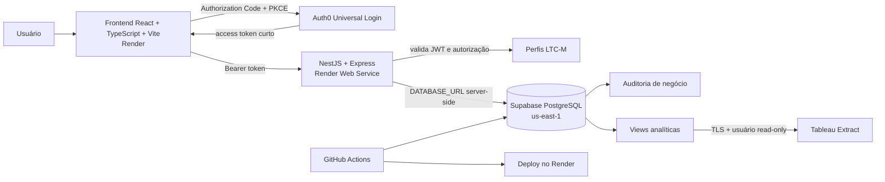

# Arquitetura da plataforma LTC-M

## Estado da decisão

| Campo                | Valor                                                              |
| -------------------- | ------------------------------------------------------------------ |
| Estado               | Aprovada para a primeira versão                                    |
| Data da baseline     | 2026-07-28                                                         |
| Registro vigente     | [ADR-0002](adr/0002-arquitetura-render-supabase-database-auth0.md) |
| Registro substituído | [ADR-0001](adr/0001-arquitetura-base-da-plataforma-ltc-m.md)       |

Esta página descreve a arquitetura vigente. A especificação funcional, as métricas e as regras de
projeto estão em [`project-specification.md`](project-specification.md). O ADR-0001 foi preservado
como histórico, mas não deve orientar novas implementações.

Esta atualização é exclusivamente documental: não aprova migrations, tabelas, implementação de
Auth0 ou backend, tenant, pipeline ou infraestrutura real.

## Princípios

- PostgreSQL hospedado no Supabase é a fonte de verdade.
- Supabase é usado somente como banco de dados, na região `us-east-1`.
- O frontend não acessa tabelas, views ou RPCs PostgreSQL diretamente.
- O backend próprio é a fronteira da API e o único componente da aplicação com acesso ao banco.
- Auth0 autentica; LTC-M autoriza as operações de negócio.
- Constraints e transações preservam integridade; grants e eventual RLS são defesa em
  profundidade.
- Ambientes e credenciais são isolados; produção nunca é usada para desenvolvimento.
- Dados financeiros, pessoais e credenciais não aparecem em logs, fixtures ou repositório.
- Tableau é um consumidor analítico excepcional, somente leitura e limitado a views.
- Métricas, moeda e grão analítico não podem ser misturados implicitamente.

## Visão geral



No fluxo operacional, somente o backend acessa o PostgreSQL. A conexão independente do Tableau é
limitada a views analíticas e a um usuário técnico somente leitura.

## 1. Frontend e workspace

A stack aprovada é:

- npm workspaces na raiz;
- `apps/web` com React, TypeScript estrito e Vite;
- evolução futura do workspace com `apps/api` em Node.js LTS, TypeScript e NestJS;
- Vitest, ESLint e Prettier;
- frontend hospedado no Render.

O frontend é uma aplicação pública: não consegue preservar segredos. Ele contém somente
configurações públicas do Auth0 e a URL pública da API. Não contém client secret, `DATABASE_URL`,
credenciais PostgreSQL ou chaves privilegiadas do Supabase.

O frontend pode validar campos e ocultar ações para melhorar a experiência, mas essas medidas não
substituem validação, autorização e integridade no backend e no banco.

## 2. Backend próprio e banco

O backend próprio será implementado com Node.js em versão LTS, TypeScript, NestJS e o adaptador
HTTP padrão Express. Ele será implantado como Render Web Service e será a única fronteira da
aplicação para acesso ao banco.

Responsabilidades do backend:

- expor a API consumida pelo frontend;
- validar bearer access tokens JWT do Auth0, incluindo JWKS, algoritmo, `issuer`, `audience` e
  expiração;
- identificar o usuário pelo claim `sub` e resolver o usuário interno por `auth_subject`;
- consultar status, perfil e permissões no banco LTC-M;
- aplicar autorização por perfis e permissões de negócio;
- validar entradas e contratos de saída;
- executar regras de negócio, transações e controle de concorrência;
- acessar PostgreSQL com papel próprio e credenciais server-side de menor privilégio;
- registrar auditoria;
- padronizar erros e respostas;
- disponibilizar health e readiness checks;
- suportar, em fases futuras, importação, projetos, itens, planejamento, realizados e aprovações;
- propagar contexto de usuário ao banco somente por mecanismo futuro, explícito e seguro.

### 2.1 NestJS e Express

O NestJS foi escolhido por oferecer arquitetura modular, controllers, services, providers,
dependency injection, guards, interceptors, pipes e filters integrados ao TypeScript. A estrutura
é adequada para regras de negócio, auditoria, autorização e testes unitários e de integração. A
escolha não garante segurança ou desempenho automaticamente.

Express será o adaptador HTTP inicial porque é o padrão do NestJS, tem amplo ecossistema Node.js,
reduz a complexidade inicial, facilita integração com middlewares e bibliotecas de autenticação e
atende ao volume inicial esperado. Fastify somente poderá ser avaliado após medição de desempenho,
gargalo real, validação de compatibilidade e nova decisão arquitetural aprovada.

### 2.2 Organização modular conceitual

```text
apps/
|-- web/
`-- api/
    `-- src/
        |-- auth/
        |-- authorization/
        |-- users/
        |-- clients/
        |-- projects/
        |-- project-items/
        |-- financial-plans/
        |-- actual-events/
        |-- imports/
        |-- audit/
        |-- health/
        `-- common/
```

Essa estrutura é conceitual; `apps/api` não existe ainda e não será criado por esta atualização.
Tipos e schemas compartilhados poderão ficar em pacote dedicado somente quando houver necessidade
concreta.

### 2.3 Camadas conceituais de autenticação e autorização

A implementação futura deverá separar:

- guard de autenticação para validar o bearer token;
- guard de autorização para perfis e permissões;
- decorator ou metadata de permissões, quando aplicável;
- serviço de usuários internos;
- auditoria de ações administrativas.

O NestJS não confiará apenas em claims de perfil enviados no token. Auth0 autentica; o LTC-M
consulta e aplica usuário ativo/inativo, perfil e permissões de negócio mantidos no PostgreSQL.

Responsabilidades do PostgreSQL:

- modelo relacional e constraints;
- precisão monetária com `numeric`;
- transações e controle de concorrência;
- integridade entre projetos, itens, planos e realizados;
- histórico e auditoria de negócio;
- views analíticas e acumulados;
- grants e eventual RLS como defesa em profundidade.

A API utilizará papel PostgreSQL próprio e de menor privilégio; credenciais administrativas não
serão usadas em operação normal. Transações serão controladas pela camada de aplicação ou pela
biblioteca de acesso a dados futuramente aprovada. A escolha de ORM, query builder ou driver
permanece pendente; esta arquitetura não escolhe Prisma, TypeORM, Drizzle ou alternativa.

O Supabase fornece somente o PostgreSQL gerenciado. Não se assume Supabase Auth, Data API, Edge
Functions, Storage, Realtime, chave `anon`, publishable key, `service_role` ou RPC exposta ao
navegador.

## 3. Autenticação com Auth0

Auth0 é o mecanismo oficial de autenticação por OpenID Connect e OAuth 2.0. O frontend React usará
Authorization Code Flow com PKCE:

1. o usuário acessa o frontend React;
2. o frontend redireciona para o Universal Login do Auth0;
3. o Auth0 autentica o usuário;
4. o frontend obtém um access token de curta duração;
5. o frontend envia o token ao backend próprio;
6. o backend valida o token antes de executar qualquer operação;
7. o backend acessa o PostgreSQL conforme a autorização de negócio.

O Auth0 é responsável por:

- login e logout;
- recuperação de acesso;
- verificação de identidade;
- emissão e renovação de tokens;
- políticas de sessão;
- MFA;
- futura integração com provedores corporativos.

O LTC-M não armazena senhas. MFA é obrigatório para administradores. Reautenticação ou step-up
authentication é requisito recomendado para ações administrativas críticas.

### Validação de token no backend

O backend deverá validar, no mínimo:

- assinatura JWT pelas chaves obtidas via JWKS;
- algoritmo contra uma lista permitida;
- `issuer`;
- `audience`;
- expiração;
- integridade do token.

Decodificar o JWT sem validar esses elementos não é suficiente. A implementação ocorrerá no
backend NestJS, sem presumir biblioteca de validação antes do scaffold.

### Tokens no frontend

A implementação futura usará o SDK oficial do Auth0 para React. Access tokens permanecerão em
memória sempre que tecnicamente possível; não se orienta armazenamento manual em `localStorage`.
O frontend não receberá Auth0 client secret.

## 4. Autenticação versus autorização

Autenticação comprova a identidade e pertence ao Auth0. Autorização de negócio pertence à
aplicação e ao banco LTC-M e inclui:

- usuário ativo ou inativo;
- perfil interno e permissões;
- acesso às operações;
- auditoria;
- aprovação, bloqueio e reabertura de previsões.

Perfis iniciais aprovados:

- `viewer`;
- `editor`;
- `admin`.

Somente `admin` pode aprovar, bloquear e reabrir previsões. A matriz completa de leitura, edição,
inativação e administração permanece pendente. Nenhuma permissão de exclusão definitiva é
presumida.

### Identidade interna

O modelo futuro terá uma entidade conceitual equivalente a `app_users`:

- identificador interno;
- `auth_subject`, igual ao claim `sub` do Auth0;
- e-mail;
- nome;
- perfil;
- status ativo/inativo;
- datas de criação e atualização.

`auth_subject` será a chave externa estável e única. E-mail não é identificador imutável.
Permissões de negócio permanecem no LTC-M, não exclusivamente no Auth0. Alterações de perfil
devem ser auditáveis.

## 5. Segurança e defesa em profundidade

O navegador não possui conexão privilegiada nem direta com o banco. `DATABASE_URL` é
exclusivamente server-side. O backend valida identidade, status e autorização antes de qualquer
operação.

Constraints, grants e eventual RLS reforçam a proteção, mas não substituem o backend. Não se
afirma que JWTs do Auth0 serão consumidos diretamente por RLS; isso dependeria de solução
aprovada para propagar o contexto com segurança. A estratégia final de RLS será revista com base
na conexão do backend e na propagação segura do contexto.

Funções transacionais PostgreSQL podem existir futuramente, mas serão chamadas pelo backend, não
expostas diretamente ao navegador. Credenciais privilegiadas nunca entram em código cliente,
logs, issues, pull requests ou screenshots.

## 6. Ambientes e desenvolvimento

| Ambiente               | Frontend/backend              | PostgreSQL                  | Dados                    | Regra                    |
| ---------------------- | ----------------------------- | --------------------------- | ------------------------ | ------------------------ |
| Local                  | Vite e NestJS locais          | Supabase CLI + Docker       | Sintéticos               | desejável                |
| Desenvolvimento remoto | serviços dev no Render        | projeto Supabase dev        | Sintéticos               | aprovado temporariamente |
| Homologação            | serviços staging no Render    | projeto Supabase staging    | Sintéticos ou mascarados | isolado                  |
| Produção               | serviços production no Render | projeto Supabase production | Reais                    | isolado e controlado     |

O Supabase local com Docker permanece desejável para migrations e testes, mas sua
indisponibilidade não bloqueia documentação. O projeto remoto de desenvolvimento:

- usa a região aprovada;
- é exclusivo e isolado;
- recebe somente dados sintéticos;
- não substitui homologação ou produção;
- não torna alterações manuais a fonte de verdade;
- deve evitar drift por meio de migrations versionadas quando o domínio for implementado.

## 7. Hospedagem, domínio e DNS

Render é a plataforma aprovada para o frontend e o backend. O domínio e a responsabilidade pelo
DNS ficam no Render. Vercel não integra a arquitetura vigente.

Build do frontend:

```text
Comando: npm run build
Diretório de saída: apps/web/dist
```

Quando roteamento cliente for adicionado, o Render deverá redirecionar rotas desconhecidas da SPA
para `index.html`. HTTPS, origens, callbacks e logout URLs devem ser separados por ambiente.
Configuração real de Render e DNS está fora desta tarefa.

O backend será um Render Web Service separado do frontend. O processo deverá escutar `PORT`,
expor endpoint obrigatório de health check, manter variáveis server-side no ambiente do serviço e
aceitar CORS somente de origens aprovadas por ambiente. A comunicação com o frontend será por
HTTPS. Build e start commands serão definidos quando `apps/api` for criado.

## 8. Variáveis e segredos

Variáveis `VITE_` são públicas e ficam incorporadas ao bundle.

### Frontend

- `VITE_APP_ENV`;
- `VITE_API_BASE_URL`;
- `VITE_AUTH0_DOMAIN`;
- `VITE_AUTH0_CLIENT_ID`;
- `VITE_AUTH0_AUDIENCE`.

### Backend, exclusivamente server-side

- `AUTH0_DOMAIN` ou issuer equivalente;
- `AUTH0_AUDIENCE`;
- `DATABASE_URL`;
- `NODE_ENV`;
- `PORT`;
- `CORS_ALLOWED_ORIGINS`;
- outras configurações de banco e segurança que a tecnologia aprovada exigir.

Não existem referências de aplicação às antigas variáveis `VITE_SUPABASE_URL`,
`VITE_SUPABASE_PUBLISHABLE_KEY`, `VITE_SUPABASE_ANON_KEY`, `SUPABASE_SECRET_KEY` ou
`SUPABASE_SERVICE_ROLE_KEY`; por isso elas foram removidas de `.env.example`, sem período de
compatibilidade. Nenhum Auth0 client secret foi criado.

`.env.example` contém somente contrato e valores locais não sensíveis. Valores reais ficam em
arquivos ignorados ou cofres separados por ambiente.

## 9. Migrations e promoção

Toda alteração futura de schema, grant, função, trigger, política ou view será migration SQL
incremental em `supabase/migrations`. Mudanças pelo Dashboard não são a fonte de verdade.

Migrations compartilhadas são imutáveis e correções usam novas migrations. Seeds contêm somente
dados sintéticos determinísticos. Mudanças destrutivas exigem revisão, backup, teste de
restauração e plano de reversão.

Nenhuma migration de domínio é criada por esta atualização documental.

## 10. CI/CD

GitHub Actions é a plataforma aprovada. O pipeline proposto, ainda não implementado, executará:

1. `npm ci`;
2. `npm run format:check`;
3. `npm run lint`;
4. `npm run typecheck`;
5. `npm test`;
6. `npm run build`;
7. verificações de dependências e segredos;
8. quando houver banco de domínio, reset/lint/testes SQL em ambiente descartável;
9. testes unitários, de integração, autenticação, autorização e contratos da API quando o backend
   existir;
10. deploy nos serviços Render do ambiente correspondente;
11. promoção controlada das mesmas migrations.

Desenvolvimento, homologação e produção terão credenciais e gates próprios. Produção exige
controles e aprovação compatíveis com o risco.

## 11. Logs, monitoramento e auditoria

Serão separadas:

- auditoria de negócio: autor, operação, registro, antes/depois e data;
- logs técnicos do frontend, backend, Render e PostgreSQL;
- monitoramento dos Extracts do Tableau.

O backend deverá ter logs estruturados com correlation/request ID, tratamento centralizado de
exceções, limitação de payload, timeouts, encerramento gracioso, health/readiness checks, auditoria
de negócio e atualização periódica de dependências. Tokens, credenciais, documentos, payloads
financeiros completos e dados pessoais desnecessários não entram em logs. Rate limiting será
avaliado conforme risco e exposição.

A implementação futura também deverá cobrir lint, typecheck, build, validação de variáveis, testes
unitários, integração, autenticação, autorização, contratos de API, fluxos financeiros críticos,
transações e concorrência. Não há meta numérica de cobertura aprovada. Ferramenta de
observabilidade, alertas, retenção e responsáveis por incidentes permanecem pendentes.

## 12. Backups e recuperação

Foi aprovada rotina mensal de backup. Também são obrigatórios testes periódicos de restauração,
com registro de evidências. O runbook deverá definir responsável e autorização para restaurar.

RPO, RTO, PITR, retenção detalhada, armazenamento externo e garantias permanecem decisões
operacionais futuras. Esta documentação não inventa valores nem capacidades do plano contratado.

## 13. Tableau

A estratégia aprovada é Tableau Extract:

- somente views analíticas com contratos estáveis e métricas reconciliadas;
- conexão PostgreSQL por TLS;
- usuário técnico exclusivo e rotacionável;
- acesso somente leitura, sem tabelas base;
- sem credenciais pessoais ou privilegiadas;
- métricas calculadas nas views, respeitando moeda e grão.

A agenda de atualização, o monitoramento e o tratamento de falhas do Extract permanecem
pendentes.

## 14. Baseline funcional aprovada

Em 2026-07-28 foram aprovados:

- dicionário de dados conceitual;
- escopo da primeira versão;
- métricas financeiras;
- Curva S de faturamento;
- regras de atualização;
- perfis `viewer`, `editor` e `admin`;
- critérios de aceite;
- itens explicitamente fora do escopo.

As definições, inclusive faturamento versus recebimento, moedas, granularidade e decisões dos
projetos, estão em [`project-specification.md`](project-specification.md).

### Tarefa 0.07 concluída

A seleção da stack e da arquitetura de implantação foi concluída com:

- React, TypeScript e Vite;
- Node.js LTS, TypeScript, NestJS e Express;
- Auth0;
- Supabase/PostgreSQL somente como banco em `us-east-1`;
- Render;
- GitHub Actions;
- Tableau Extract;
- backup mensal.

Essa conclusão não abrange as decisões operacionais ainda listadas abaixo.

## 15. Decisões pendentes

- biblioteca de acesso ao PostgreSQL;
- matriz completa de permissões, especialmente exclusão e inativação;
- significado oficial da unidade `US`;
- periodicidade, SLA e data de corte das atualizações;
- política de conversão monetária;
- agenda, monitoramento e tratamento de falhas dos Extracts do Tableau;
- RPO, RTO, PITR e retenção detalhada;
- estratégia final de RLS e propagação segura de contexto;
- ferramenta de observabilidade, alertas e responsáveis por incidentes;
- parâmetros operacionais de sessão e step-up além do MFA obrigatório para administradores.
