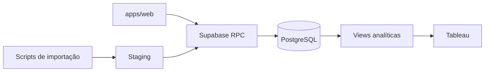

# Arquitetura inicial

## Objetivo

O LTC-M será uma solução integrada com:

1. aplicação web para operação dos cadastros e fluxos;
2. Supabase/PostgreSQL como fonte de verdade e camada transacional;
3. views SQL estáveis para consumo do Tableau;
4. auditoria e importação controlada de dados legados.

Esta fundação não define o schema de domínio. As migrations devem ser implementadas após a
conclusão e validação das dependências 0.07 e 0.08.

A especificação funcional que orienta essas etapas está preservada em
[`project-specification.md`](project-specification.md). Em caso de divergência, uma decisão de
negócio aprovada e registrada deve preceder qualquer alteração de schema.

## Organização

O frontend acessará somente APIs autorizadas do Supabase. Operações compostas, controle de
concorrência e validações financeiras devem ser transacionais. O Tableau acessará apenas views
publicadas por uma função de banco somente leitura.

## Regras preservadas

- `project_code` será uma chave natural normalizada e única.
- Item comercial repetido é válido; a identidade operacional será baseada em uma chave de linha
  estável dentro do projeto.
- Contrato, saldo de abertura, soma de itens, planejado e realizado são conceitos separados.
- Valores monetários usam `numeric`, nunca tipos de ponto flutuante.
- Planejamento mensal usa linhas por competência, não colunas por mês.
- Dados aprovados são versionados; exclusões de domínio mantêm histórico.
- Realizados exigem chave de origem para impedir duplicidade.
- Acumulados e percentuais são calculados em views, não persistidos como fatos.

## Decisões pendentes

Antes do schema definitivo, precisam ser confirmados:

- significado contábil de “realizado”;
- limites entre valor contratual e escopo LTC-M;
- tratamento das divergências dos projetos identificados na planilha;
- significado da unidade `US`;
- suporte a múltiplas moedas por projeto;
- granularidade do planejamento, por projeto, item ou ambos;
- natureza das regras 30/70;
- aprovação, congelamento e reabertura de planos;
- papéis autorizados e periodicidade de atualização.

Essas decisões não devem ser ocultadas por defaults técnicos.

## Ambientes

- Local: Vite em `127.0.0.1:5173` e stack Supabase em Docker.
- Homologação: pendente de definição.
- Produção: pendente de definição.

Segredos são configurados fora do repositório. O app web nunca recebe a chave `service_role`.
