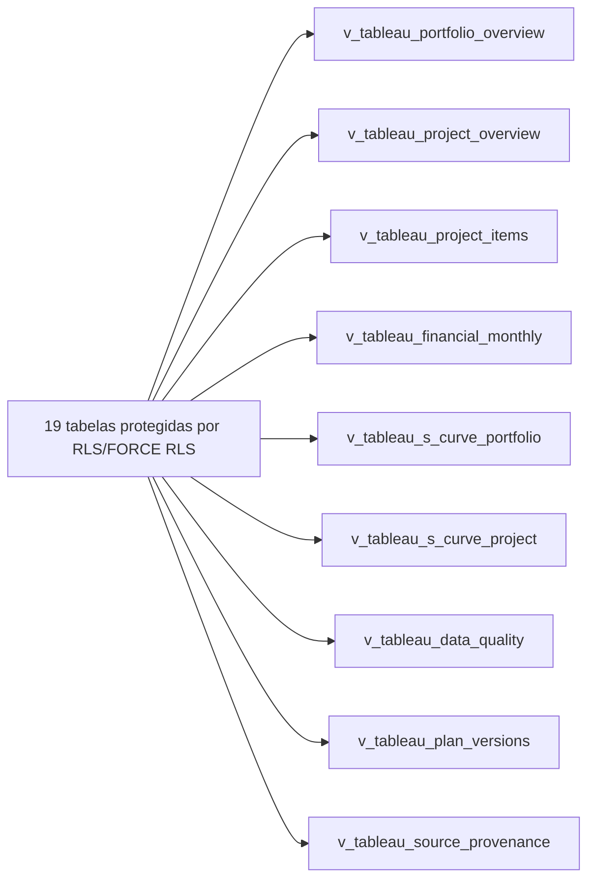

# ERD do schema `ltc_m`

Contrato: `ltcm.p017.schema-integrity.v1`
Fingerprint: `0c63209deff70ac9fcf04d84cba6bd732925339084e0e51648b8e09063737e91`

Arquivo gerado deterministicamente a partir do modelo canônico capturado em PostgreSQL 17.
Não editar manualmente; use `npm run docs:schema:generate` e valide com
`npm run docs:schema:check`.

## Entidades e relacionamentos

```mermaid
erDiagram
  app_users {
    uuid id PK
    text auth_subject
    text email
    text full_name
    ltc_m_app_role role
    boolean active
    timestamp_with_time_zone created_at
    timestamp_with_time_zone updated_at
    bigint row_version
  }
  audit_log {
    bigint id PK
    text actor_auth_subject
    text source
    text justification
    bigint previous_row_version
    bigint new_row_version
    jsonb metadata
    text table_name
    text record_id
    ltc_m_audit_operation operation
    jsonb old_data
    jsonb new_data
    uuid changed_by_user_id FK
    text request_id
    timestamp_with_time_zone changed_at
  }
  clients {
    uuid id PK
    timestamp_with_time_zone deleted_at
    bigint row_version
    text legal_name
    text display_name
    text tax_id
    boolean active
    uuid created_by_user_id FK
    uuid updated_by_user_id FK
    timestamp_with_time_zone created_at
    timestamp_with_time_zone updated_at
  }
  currencies {
    text code PK
    text name
    smallint decimal_places
    boolean active
    timestamp_with_time_zone updated_at
    bigint row_version
  }
  financial_actual_events {
    uuid id PK
    text currency_code FK
    ltc_m_actual_status status
    text notes
    uuid created_by_user_id FK
    uuid updated_by_user_id FK
    timestamp_with_time_zone created_at
    timestamp_with_time_zone updated_at
    bigint row_version
    uuid project_id FK
    uuid project_item_id FK
    ltc_m_actual_financial_metric metric_type
    date competence_date
    text source_key
    text document_number
    text installment_key
    numeric_20_2_ amount
  }
  financial_plan_lines {
    uuid id PK
    text notes
    uuid created_by_user_id FK
    uuid updated_by_user_id FK
    timestamp_with_time_zone created_at
    timestamp_with_time_zone updated_at
    bigint row_version
    uuid plan_version_id FK
    uuid project_id FK
    uuid project_item_id FK
    ltc_m_planned_financial_metric metric_type FK
    ltc_m_planning_level planning_level FK
    date competence_month
    numeric_20_2_ amount
    text currency_code FK
  }
  financial_plan_scopes {
    uuid id PK
    timestamp_with_time_zone updated_at
    bigint row_version
    uuid plan_version_id FK
    uuid project_id FK
    ltc_m_planned_financial_metric metric_type
    ltc_m_planning_level planning_level
    text currency_code FK
    uuid created_by_user_id FK
    uuid updated_by_user_id FK
    timestamp_with_time_zone created_at
  }
  import_batch_sheets {
    uuid id PK
    integer staged_rows
    integer rejected_rows
    text content_hash
    text status
    text technical_message
    jsonb metadata
    timestamp_with_time_zone created_at
    timestamp_with_time_zone updated_at
    bigint row_version
    uuid created_by_user_id FK
    uuid import_batch_id FK
    uuid updated_by_user_id FK
    text request_id
    text sheet_key
    text sheet_name
    integer sheet_index
    text detected_range
    integer first_row
    integer last_row
    integer found_rows
  }
  import_batches {
    uuid id PK
    timestamp_with_time_zone created_at
    timestamp_with_time_zone completed_at
    timestamp_with_time_zone updated_at
    bigint row_version
    bigint source_size_bytes
    text source_mime_type
    integer payload_schema_version
    text idempotency_key
    text request_id
    timestamp_with_time_zone started_at
    text source_name
    integer sheet_count
    integer staged_rows
    integer valid_rows
    integer error_count
    text technical_message
    jsonb metadata
    uuid updated_by_user_id FK
    text source_hash
    date reference_date
    ltc_m_import_status status
    integer received_rows
    integer accepted_rows
    integer rejected_rows
    uuid submitted_by_user_id FK
  }
  import_row_errors {
    bigint id PK
    timestamp_with_time_zone created_at
    uuid import_batch_sheet_id FK
    uuid import_staging_row_id FK
    text severity
    text field_path
    jsonb raw_value
    text technical_detail
    text error_key
    text request_id
    uuid created_by_user_id FK
    uuid batch_id FK
    text sheet_name
    integer source_row
    text entity_type
    text natural_key
    text error_code
    text error_message
    jsonb raw_payload
  }
  import_staging_rows {
    uuid id PK
    integer validation_attempt
    text target_table
    uuid target_record_id
    timestamp_with_time_zone validated_at
    timestamp_with_time_zone processed_at
    text last_error_code
    text last_error_summary
    timestamp_with_time_zone created_at
    timestamp_with_time_zone updated_at
    bigint row_version
    uuid import_batch_sheet_id FK
    uuid created_by_user_id FK
    uuid updated_by_user_id FK
    text request_id
    integer source_row_number
    text source_range
    text row_kind
    integer payload_schema_version
    jsonb raw_payload
    text row_hash
    text status
  }
  monthly_plan_baselines {
    uuid id PK
    uuid plan_version_id FK
    ltc_m_planned_financial_metric metric_type
    ltc_m_planning_level planning_level
    text semantic_contract_version
    text semantic_fingerprint
    uuid created_by_user_id FK
    timestamp_with_time_zone created_at
  }
  monthly_plan_cells {
    uuid id PK
    ltc_m_planned_financial_metric metric_type FK
    ltc_m_planning_level planning_level FK
    date competence_month FK
    text source_line_key
    text source_item_number
    integer source_row_number
    text source_column
    text source_cell_reference
    text declaration_state
    text source_numeric_text
    uuid import_batch_id FK
    text source_value_hash
    numeric_20_2_ canonical_amount FK
    uuid financial_plan_line_id FK
    uuid created_by_user_id FK
    timestamp_with_time_zone created_at
    uuid import_batch_sheet_id FK
    uuid import_staging_row_id FK
    uuid baseline_id FK
    text baseline_semantic_fingerprint FK
    uuid plan_version_id FK
    uuid project_id FK
    uuid project_item_id FK
  }
  monthly_plan_import_executions {
    uuid id PK
    uuid created_by_user_id FK
    timestamp_with_time_zone created_at
    uuid import_batch_id FK
    uuid source_artifact_id FK
    text source_sha256 FK
    uuid baseline_id FK
    text baseline_semantic_fingerprint FK
    uuid plan_version_id FK
    ltc_m_planned_financial_metric metric_type FK
    ltc_m_planning_level planning_level FK
  }
  monthly_source_artifacts {
    uuid id PK
    text source_semantic_fingerprint
    uuid created_by_user_id FK
    timestamp_with_time_zone created_at
    text source_sha256
    bigint source_size_bytes
    text source_mime_type
    text source_name
    text source_contract_version
    text worksheet_key
    text worksheet_name
    text structural_range
  }
  plan_versions {
    uuid id PK
    timestamp_with_time_zone created_at
    timestamp_with_time_zone updated_at
    bigint row_version
    uuid updated_by_user_id FK
    uuid source_plan_version_id FK
    bigint content_revision
    uuid baseline_plan_version_id FK
    text name
    date reference_date
    ltc_m_plan_status status
    boolean is_baseline
    text notes
    uuid created_by_user_id FK
    uuid approved_by_user_id FK
    timestamp_with_time_zone approved_at
  }
  project_items {
    uuid id PK
    numeric_20_4_ unit_price
    numeric_20_2_ total_amount
    boolean active
    text notes
    uuid created_by_user_id FK
    uuid updated_by_user_id FK
    timestamp_with_time_zone created_at
    timestamp_with_time_zone updated_at
    timestamp_with_time_zone deleted_at
    bigint row_version
    uuid project_id FK
    text source_line_key
    integer line_number
    text item_code
    text description
    numeric_20_4_ quantity
    text unit_code FK
    text currency_code FK
  }
  projects {
    uuid id PK
    numeric_20_2_ opening_balance
    numeric_20_2_ budget_cost
    date start_date
    date end_date
    uuid manager_user_id FK
    date data_reference_date
    text notes
    integer version
    uuid created_by_user_id FK
    uuid updated_by_user_id FK
    text project_code
    timestamp_with_time_zone created_at
    timestamp_with_time_zone updated_at
    timestamp_with_time_zone deleted_at
    uuid legacy_import_batch_id FK
    text project_name
    uuid client_id FK
    text reporting_group
    ltc_m_project_classification classification
    ltc_m_project_status status
    text base_currency FK
    numeric_20_2_ contract_value
  }
  units {
    text code PK
    text name
    text category
    boolean active
    timestamp_with_time_zone updated_at
    bigint row_version
  }
  app_users ||--o{ audit_log : "audit_log_changed_by_user_id_fkey"
  app_users ||--o{ clients : "clients_created_by_user_id_fkey"
  app_users ||--o{ clients : "clients_updated_by_user_id_fkey"
  app_users ||--o{ financial_actual_events : "financial_actual_events_created_by_user_id_fkey"
  app_users ||--o{ financial_actual_events : "financial_actual_events_updated_by_user_id_fkey"
  project_items ||--o{ financial_actual_events : "fk_financial_actual_item"
  projects ||--o{ financial_actual_events : "fk_financial_actual_project_currency"
  app_users ||--o{ financial_plan_lines : "financial_plan_lines_created_by_user_id_fkey"
  app_users ||--o{ financial_plan_lines : "financial_plan_lines_updated_by_user_id_fkey"
  project_items ||--o{ financial_plan_lines : "fk_financial_plan_lines_item"
  financial_plan_scopes ||--o{ financial_plan_lines : "fk_financial_plan_lines_scope"
  app_users ||--o{ financial_plan_scopes : "financial_plan_scopes_created_by_user_id_fkey"
  plan_versions ||--o{ financial_plan_scopes : "financial_plan_scopes_plan_version_id_fkey"
  app_users ||--o{ financial_plan_scopes : "financial_plan_scopes_updated_by_user_id_fkey"
  projects ||--o{ financial_plan_scopes : "fk_financial_plan_scopes_project_currency"
  app_users ||--o{ import_batch_sheets : "import_batch_sheets_created_by_user_id_fkey"
  import_batches ||--o{ import_batch_sheets : "import_batch_sheets_import_batch_id_fkey"
  app_users ||--o{ import_batch_sheets : "import_batch_sheets_updated_by_user_id_fkey"
  app_users ||--o{ import_batches : "import_batches_submitted_by_user_id_fkey"
  app_users ||--o{ import_batches : "import_batches_updated_by_user_id_fkey"
  import_batches ||--o{ import_row_errors : "import_row_errors_batch_id_fkey"
  app_users ||--o{ import_row_errors : "import_row_errors_created_by_user_id_fkey"
  import_batch_sheets ||--o{ import_row_errors : "import_row_errors_import_batch_sheet_id_fkey"
  import_staging_rows ||--o{ import_row_errors : "import_row_errors_import_staging_row_id_fkey"
  app_users ||--o{ import_staging_rows : "import_staging_rows_created_by_user_id_fkey"
  import_batch_sheets ||--o{ import_staging_rows : "import_staging_rows_import_batch_sheet_id_fkey"
  app_users ||--o{ import_staging_rows : "import_staging_rows_updated_by_user_id_fkey"
  app_users ||--o{ monthly_plan_baselines : "monthly_plan_baselines_created_by_user_id_fkey"
  plan_versions ||--o{ monthly_plan_baselines : "monthly_plan_baselines_plan_version_id_fkey"
  monthly_plan_import_executions ||--o{ monthly_plan_cells : "fk_monthly_plan_cells_execution_p013"
  financial_plan_lines ||--o{ monthly_plan_cells : "fk_monthly_plan_cells_plan_line_p013"
  project_items ||--o{ monthly_plan_cells : "fk_monthly_plan_cells_project_item_p013"
  import_batch_sheets ||--o{ monthly_plan_cells : "fk_monthly_plan_cells_sheet_p013"
  import_staging_rows ||--o{ monthly_plan_cells : "fk_monthly_plan_cells_staging_row_p013"
  app_users ||--o{ monthly_plan_cells : "monthly_plan_cells_created_by_user_id_fkey"
  monthly_source_artifacts ||--o{ monthly_plan_import_executions : "fk_monthly_executions_artifact_p013"
  monthly_plan_baselines ||--o{ monthly_plan_import_executions : "fk_monthly_executions_baseline_p013"
  import_batches ||--o{ monthly_plan_import_executions : "fk_monthly_executions_batch_hash_p013"
  app_users ||--o{ monthly_plan_import_executions : "monthly_plan_import_executions_created_by_user_id_fkey"
  app_users ||--o{ monthly_source_artifacts : "monthly_source_artifacts_created_by_user_id_fkey"
  app_users ||--o{ plan_versions : "plan_versions_approved_by_user_id_fkey"
  plan_versions ||--o{ plan_versions : "plan_versions_baseline_plan_version_id_fkey"
  app_users ||--o{ plan_versions : "plan_versions_created_by_user_id_fkey"
  plan_versions ||--o{ plan_versions : "plan_versions_source_plan_version_id_fkey"
  app_users ||--o{ plan_versions : "plan_versions_updated_by_user_id_fkey"
  projects ||--o{ project_items : "fk_project_items_project_currency"
  app_users ||--o{ project_items : "project_items_created_by_user_id_fkey"
  units ||--o{ project_items : "project_items_unit_code_fkey"
  app_users ||--o{ project_items : "project_items_updated_by_user_id_fkey"
  import_batches ||--o{ projects : "fk_projects_legacy_import_batch"
  currencies ||--o{ projects : "projects_base_currency_fkey"
  clients ||--o{ projects : "projects_client_id_fkey"
  app_users ||--o{ projects : "projects_created_by_user_id_fkey"
  app_users ||--o{ projects : "projects_manager_user_id_fkey"
  app_users ||--o{ projects : "projects_updated_by_user_id_fkey"
```

## Camada analítica derivada

As setas da camada analítica indicam derivação, não FKs. Grãos e chaves das views são
definidos no dicionário e no contrato P016.
