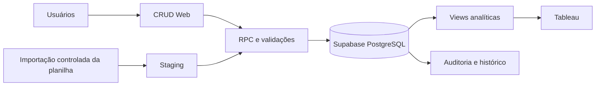
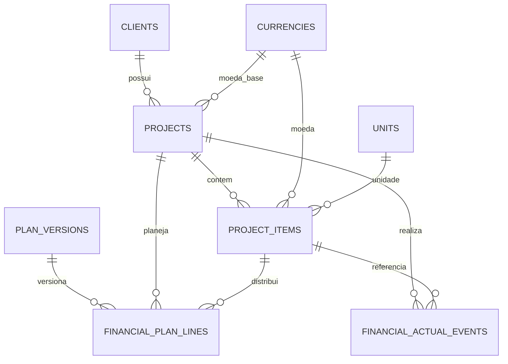

# Projeto de Banco de Dados, CRUD e Dashboard LTC-M

## 1. Objetivo

Construir uma solução integrada para controlar o portfólio de projetos LTC-M, substituindo a lógica dispersa da planilha por:

1. banco relacional normalizado no Supabase/PostgreSQL;
2. sistema CRUD para cadastro e atualização manual;
3. camada analítica para Tableau, incluindo Curva S do avanço financeiro;
4. validações, histórico e rastreabilidade das alterações.

A solução deve permitir que novos dados sejam inseridos periodicamente e associados ao projeto correto, sem sobrescrever informações indevidas nem duplicar valores.

---

## 2. Diagnóstico da planilha analisada

### 2.1 Estrutura encontrada

A pasta possui três abas:

- **Valores Projetos LTC-M**: resumo por projeto com Valor de Venda, Faturado, A Faturar, Custo Orçado, Custo Incorrido e Resultados.
- **Prev. Receita Mensal**: itens dos projetos, quantidade, unidade, moeda, preço unitário, preço total e distribuição mensal prevista.
- **Curva S**: consolidação mensal do previsto e uma linha manual de realizado.

### 2.2 Perfil dos dados

- 9 códigos de projeto.
- 48 linhas de itens.
- 9 competências mensais, de julho/2026 a março/2027.
- Todos os registros atuais estão em BRL.
- Unidades encontradas: Unidade, Serviço e US.
- Valor total das linhas da aba de previsão: **R$ 31.517.382,39**.
- Valor programado nos meses: **R$ 2.800.460,15**.
- Somente 5 dos 9 projetos possuem algum valor programado.
- Somente 4 projetos estão integralmente distribuídos nos meses.

### 2.3 Problemas de qualidade e modelagem

1. **Formato largo da previsão**: cada mês é uma coluna. A inclusão de novos meses exige alterar a estrutura da planilha e do dashboard.
2. **Resumo e detalhe misturados**: alguns valores do resumo são fórmulas e outros são digitados manualmente.
3. **Possível dupla contagem**: o valor de R$ 1.028.550,00 do projeto 2024-10-12524 é calculado com as linhas do próprio projeto mais a linha de R$ 343.730,00 do projeto 2025-07-14416; esse segundo projeto também aparece separadamente no resumo.
4. **Divergência no projeto 2026-04-16531**: item comercial de R$ 168.000,00, resumo e previsão mensal de R$ 164.000,00; diferença de R$ 4.000,00.
5. **Contrato total versus saldo**: o projeto 2024-02-10990 aparece com R$ 2.260.099,66 no resumo e somente R$ 369.749,17 como saldo na previsão mensal. Esses conceitos precisam ser campos diferentes.
6. **Projetos sem programação mensal**: os projetos de maior valor, incluindo 2025-12-15568 e 2026-01-15797, ainda não alimentam a Curva S.
7. **Clientes não normalizados**: PETROBRAS aparece com variações como “PETROBRAS IBT (saldo)”, “PETROBRAS SRP/BF (Demanda)” e “PETROBRAS (Demanda)”. Saldo e Demanda devem ser atributos do projeto, não parte do nome do cliente.
8. **Código de projeto com espaço inicial**: 2024-06-11837 contém espaço antes do código.
9. **Código de item repetido no mesmo projeto**: há códigos repetidos com quantidades ou linhas diferentes. Portanto, projeto + código do item não pode ser a chave única.
10. **Linhas incompletas**: o projeto FLEET possui código e descrição vazios.
11. **Realizado sem vínculo documental**: o valor realizado da Curva S é digitado diretamente em uma célula agregada, sem projeto, documento, competência ou usuário responsável.
12. **Curva S incompleta**: o realizado acumulado não está preenchido ao longo dos meses e o gráfico combina valores mensais sem uma estrutura confiável de acumulado.
13. **Percentuais 30/70 embutidos em fórmulas**: regras comerciais específicas estão espalhadas pelas células e não possuem versão ou justificativa.
14. **Sem histórico de atualização**: existe apenas uma observação textual de atualização, sem lote, autor ou data de referência estruturada.

### 2.4 Reconciliação inicial por projeto

| Projeto | Total das linhas | Programado mensal | Saldo sem programação |
|---|---:|---:|---:|
| 2024-02-10990 | R$ 369.749,17 | R$ 369.749,17 | R$ 0,00 |
| 2024-06-11837 | R$ 2.783.700,00 | R$ 0,00 | R$ 2.783.700,00 |
| 2024-10-12524 | R$ 684.820,00 | R$ 684.820,00 | R$ 0,00 |
| 2025-07-14416 | R$ 343.730,00 | R$ 343.730,00 | R$ 0,00 |
| 2025-08-14656 | R$ 1.238.160,98 | R$ 1.238.160,98 | R$ 0,00 |
| 2025-12-15568 | R$ 13.786.887,44 | R$ 0,00 | R$ 13.786.887,44 |
| 2026-01-15797 | R$ 12.095.014,80 | R$ 0,00 | R$ 12.095.014,80 |
| 2026-03-16231 | R$ 47.320,00 | R$ 0,00 | R$ 47.320,00 |
| 2026-04-16531 | R$ 168.000,00 | R$ 164.000,00 | R$ 4.000,00 |

A diferença entre “Valor Total do Contrato”, “Saldo Contratual”, “Valor dos Itens Ativos” e “Valor Programado” deve ser mantida explicitamente no banco; não deve ser resolvida por uma única coluna genérica de valor.

---

## 3. Arquitetura proposta

### Componentes

- **Frontend CRUD**: Bubble.io, React/Next.js ou outra interface web.
- **Backend**: Supabase/PostgreSQL.
- **Autenticação**: usuários autenticados e perfis com papéis.
- **Regras transacionais**: funções RPC para salvar projeto, itens e programação em uma única transação.
- **Camada analítica**: views específicas para Tableau.
- **Auditoria**: registro de inclusão, alteração, exclusão lógica, usuário e data.
- **Importação opcional**: staging para futuras cargas de planilha sem gravar diretamente nas tabelas finais.

---

# ETAPA 1 — Banco relacional e normalização

## 4. Modelo de dados proposto

### 4.1 Tabelas principais

#### `clients`
Cadastro único de clientes.

Campos principais:

- `id` UUID;
- `legal_name`;
- `display_name`;
- `tax_id`;
- `active`;
- datas de criação e atualização.

#### `projects`
Cadastro mestre do projeto.

Campos principais:

- `id` UUID;
- `project_code` — código natural único, por exemplo 2026-01-15797;
- `project_name`;
- `client_id`;
- `classification` — contrato completo, demanda ou saldo;
- `status`;
- `base_currency`;
- `contract_value` — valor total contratual;
- `opening_balance` — saldo trazido para o horizonte, quando aplicável;
- `budget_cost` — custo orçado atual;
- `start_date` e `end_date`;
- `manager_user_id`;
- `data_reference_date`;
- `notes`;
- `version` para controle de concorrência;
- `created_at`, `updated_at` e `deleted_at`.

#### `project_items`
Itens comerciais ou de serviço de cada projeto.

Campos principais:

- `id` UUID;
- `project_id`;
- `line_number`;
- `source_line_key` — identificador estável da linha;
- `item_code`;
- `description`;
- `quantity`;
- `unit_code`;
- `currency_code`;
- `unit_price`;
- `total_amount` calculado;
- `active`;
- datas de criação e atualização.

**Regra crítica:** código do item pode repetir. A chave operacional deve ser `project_id + source_line_key` ou `project_id + line_number`, nunca somente projeto + código.

#### `plan_versions`
Versões da previsão financeira.

Campos principais:

- `id` UUID;
- `name`;
- `reference_date`;
- `status`: rascunho, aprovado, bloqueado ou arquivado;
- `is_baseline`;
- `created_by`;
- `approved_by` e `approved_at`.

Essa tabela permite comparar o plano-base com revisões posteriores sem apagar o histórico.

#### `financial_plan_lines`
Distribuição mensal planejada em formato normalizado.

Cada registro representa um valor em um mês:

- `plan_version_id`;
- `project_id`;
- `project_item_id`, quando aplicável;
- `metric_type`: faturamento, recebimento, receita ou custo;
- `competence_month` — sempre o primeiro dia do mês;
- `amount`;
- `currency_code`;
- `notes`.

Em vez de criar uma coluna para Jul/26, Ago/26 etc., são criadas linhas. Novos meses não alteram o banco.

#### `financial_actual_events`
Movimentos realizados.

Campos principais:

- `project_id`;
- `project_item_id`, opcional;
- `metric_type`: faturamento, recebimento, receita ou custo;
- `competence_date`;
- `source_key` — chave obrigatória para impedir duplicidade;
- `document_number`;
- `installment_key`;
- `amount`;
- `currency_code`;
- `status`;
- `notes`;
- usuário e datas de criação/alteração.

#### `units` e `currencies`
Cadastros de referência para evitar digitação livre.

Exemplos de unidade inicial:

- `UN` — Unidade;
- `SERV` — Serviço;
- `US` — Unidade de Serviço, após confirmação da regra de negócio.

#### `import_batches` e `import_row_errors`
Controle das importações futuras:

- arquivo/lote;
- data de referência;
- usuário;
- quantidade recebida, aceita e rejeitada;
- erros por linha;
- hash opcional do arquivo.

#### `audit_log`
Histórico das mudanças com tabela, registro, operação, valores anteriores, novos valores, usuário e data.

### 4.2 Relacionamentos

## 5. Regras de normalização

1. Remover espaços externos dos códigos.
2. Converter códigos de projeto para um padrão único.
3. Separar cliente, unidade operacional e classificação do projeto.
4. Transformar colunas mensais em linhas.
5. Manter contrato total, saldo, valor dos itens, programado e realizado como medidas distintas.
6. Não gravar acumulados e percentuais; eles devem ser calculados por views.
7. Não permitir preço total digitado: `quantidade × preço unitário`.
8. Não permitir “A Faturar” digitado: `valor contratual − faturado realizado`, conforme regra aprovada.
9. Não permitir resultado digitado: calculá-lo com receita/faturamento e custo.
10. Utilizar `numeric`, nunca ponto flutuante, para valores monetários.
11. Registrar moeda em todas as linhas financeiras, mesmo que hoje somente BRL seja utilizado.
12. Se houver consolidação de moedas no futuro, criar tabela de câmbio por data e manter o valor original.

## 6. Processo de migração inicial

1. Carregar as três abas em tabelas de staging, preservando a linha de origem.
2. Limpar códigos, textos, unidades e clientes.
3. Criar clientes únicos.
4. Criar projetos únicos pelo código normalizado.
5. Criar itens com uma chave de linha estável.
6. Despivotar os meses para `financial_plan_lines`.
7. Criar uma versão de plano chamada, por exemplo, `Baseline - Planilha inicial`.
8. Importar o realizado somente depois de identificar seu conceito: faturamento, recebimento ou receita.
9. Executar reconciliações automáticas.
10. Liberar a migração somente após aprovação das divergências.

### Validações de reconciliação

- soma dos itens por projeto versus valor dos itens informado;
- soma do plano mensal versus valor que deveria ser programado;
- faturado + a faturar versus valor contratual;
- custo orçado versus custos planejados;
- documentos realizados duplicados;
- itens sem código, descrição, unidade ou quantidade;
- projetos sem cliente ou sem moeda;
- valores negativos ou datas inválidas;
- programação fora das datas do projeto, quando essa regra for obrigatória.

---

# ETAPA 2 — Sistema CRUD

## 7. Perfis de acesso

- **Visualizador**: consulta dados e dashboards.
- **Editor**: cadastra e altera projetos, itens, planos e realizados.
- **Aprovador financeiro**: aprova e bloqueia versões da previsão.
- **Administrador**: gerencia cadastros, usuários e exclusões lógicas.

## 8. Telas sugeridas

### 8.1 Lista de projetos

Exibir:

- código;
- cliente;
- nome;
- status;
- valor contratual;
- faturado;
- a faturar;
- previsto no horizonte;
- saldo sem programação;
- última atualização;
- alerta de inconsistência.

Ações:

- abrir;
- editar;
- duplicar versão de previsão;
- encerrar;
- exportar;
- consultar histórico.

### 8.2 Cadastro do projeto

#### Campos que o usuário deve informar

| Grupo | Campo | Obrigatório | Regra |
|---|---|---:|---|
| Identificação | Código do projeto | Sim | Único, sem espaços externos |
| Identificação | Nome do projeto | Sim | Texto padronizado |
| Identificação | Cliente | Sim | Seleção do cadastro, sem texto livre |
| Identificação | Classificação | Sim | Contrato completo, Demanda ou Saldo |
| Controle | Status | Sim | Lista controlada |
| Controle | Responsável | Recomendado | Usuário ou responsável cadastrado |
| Controle | Data inicial | Recomendado | Data válida |
| Controle | Data final | Recomendado | Maior ou igual à data inicial |
| Financeiro | Moeda-base | Sim | Código ISO, inicialmente BRL |
| Financeiro | Valor contratual | Sim | Maior ou igual a zero |
| Financeiro | Saldo de abertura | Condicional | Para projetos carregados apenas com saldo |
| Financeiro | Custo orçado | Recomendado | Maior ou igual a zero |
| Governança | Data de referência | Sim | Data da informação recebida |
| Governança | Observações | Não | Justificativas e contexto |

#### Campos calculados, não editáveis

- valor total dos itens;
- valor programado;
- saldo sem programação;
- faturado realizado;
- recebido realizado;
- a faturar;
- custo incorrido;
- resultado orçado;
- resultado realizado;
- margem;
- avanço financeiro;
- datas de criação e alteração.

### 8.3 Itens do projeto

Campos manuais relevantes, conforme a planilha:

- projeto;
- número da linha;
- código do item;
- descrição;
- quantidade;
- UN/unidade;
- moeda;
- preço unitário;
- observação;
- ativo/inativo.

Campos calculados:

- preço total;
- total programado do item;
- saldo do item sem programação;
- total realizado do item.

A tela deve aceitar vários itens e permitir duplicação de uma linha para agilizar o cadastro, mas deve gerar uma chave interna nova.

### 8.4 Programação mensal

Interface recomendada:

- seletor de projeto;
- seletor de versão;
- visão por item ou por projeto;
- grade mensal dinâmica;
- distribuição automática opcional por percentual;
- botão “distribuir saldo”;
- campo de justificativa;
- indicador de diferença em tempo real.

Regras:

- o total programado não pode exceder o limite definido, salvo autorização;
- valores mensais podem ser zero;
- não apagar versões aprovadas;
- revisões criam nova versão;
- linha aprovada deve ser bloqueada para edição comum.

### 8.5 Lançamentos realizados

Campos:

- projeto;
- item, quando aplicável;
- tipo: faturamento, recebimento, receita ou custo;
- competência;
- chave de origem;
- número do documento;
- parcela;
- moeda;
- valor;
- situação;
- observação/anexo opcional.

A chave de origem é obrigatória para prevenir lançamentos duplicados.

### 8.6 Central de inconsistências

Mostrar:

- valor contratual diferente do valor dos itens;
- programação maior que o saldo;
- saldo não programado;
- item incompleto;
- projeto sem atualização recente;
- documento duplicado;
- moeda divergente;
- realizado sem projeto ou competência;
- diferença entre resumo e detalhe.

## 9. Comportamento de atualização — UPSERT

### Projeto

- procurar pelo `project_code` normalizado;
- se não existir, inserir;
- se existir, atualizar somente os campos enviados e autorizados;
- usar `version` ou `updated_at` para impedir que um usuário sobrescreva uma edição mais recente.

### Item

- procurar por `project_id + source_line_key`;
- não usar somente `item_code`, pois a planilha possui códigos repetidos;
- uma exclusão deve ser lógica, mantendo histórico.

### Programação mensal

- chave: versão + projeto + item + tipo de métrica + competência;
- se existir, atualizar o valor;
- se não existir, inserir;
- salvar o conjunto em uma transação única.

### Realizado

- chave: projeto + `source_key`;
- não fazer upsert usando apenas data e valor;
- documento cancelado deve continuar registrado com status cancelado.

## 10. Fluxo de gravação recomendado

1. Usuário abre o projeto.
2. Frontend carrega a versão atual do registro.
3. Usuário altera projeto, itens ou programação.
4. Frontend envia um pacote para uma função RPC.
5. A RPC valida chaves, totais, permissões e concorrência.
6. Todas as alterações são gravadas em uma transação.
7. Auditoria registra antes/depois.
8. Views do Tableau passam a refletir os novos dados.

---

# ETAPA 3 — Dashboard Tableau

## 11. Modelo analítico

### Dimensões

- Projeto;
- Cliente;
- Data/Mês;
- Item;
- Unidade;
- Moeda;
- Status;
- Classificação;
- Responsável;
- Versão da previsão.

### Fatos

- valor contratual;
- valor dos itens;
- faturamento planejado;
- recebimento planejado;
- receita planejada;
- custo planejado;
- faturamento realizado;
- recebimento realizado;
- receita realizada;
- custo realizado.

O Tableau deve consumir views prontas, evitando cálculos complexos e joins feitos diretamente no workbook.

## 12. Dashboard 1 — Visão Executiva do Portfólio

### KPIs

- Valor contratual total;
- Valor dos itens ativos;
- Faturado realizado;
- Recebido realizado;
- A faturar;
- Previsto no horizonte;
- Saldo sem programação;
- Custo orçado;
- Custo realizado;
- Resultado e margem;
- quantidade de projetos ativos;
- projetos com inconsistência.

### Visuais

- barras por projeto e cliente;
- contratado versus faturado versus recebido;
- ranking de saldo a faturar;
- composição por classificação: contrato, demanda e saldo;
- calendário/heatmap da previsão mensal;
- alertas de projetos sem programação.

### Filtros

- período;
- projeto;
- cliente;
- status;
- classificação;
- responsável;
- moeda;
- versão do plano.

## 13. Dashboard 2 — Curva S do Avanço Financeiro LTC-M

### Visual principal recomendado

Gráfico combinado:

- **barras**: previsto mensal e realizado mensal;
- **linha 1**: previsto acumulado percentual;
- **linha 2**: realizado acumulado percentual;
- eixo secundário de 0% a 100%;
- linha vertical na data de corte;
- tooltip com valores mensais, acumulados, diferença e versão.

### Indicadores da Curva S

- previsto acumulado na data de corte;
- realizado acumulado na data de corte;
- desvio acumulado em R$;
- desvio acumulado em pontos percentuais;
- aderência ao plano: realizado acumulado ÷ previsto acumulado;
- saldo sem programação;
- mês previsto de conclusão;
- última competência realizada.

### Definições recomendadas

- **Avanço financeiro do contrato** = faturado acumulado ÷ valor contratual.
- **Avanço financeiro do plano** = realizado acumulado ÷ total do plano-base.
- **Aderência à Curva S** = realizado acumulado até a data de corte ÷ previsto acumulado até a mesma data.

Essas três medidas não devem ser tratadas como sinônimos.

### Comparações interativas

- portfólio completo;
- um ou vários projetos;
- cliente;
- plano-base versus previsão atual;
- faturamento versus recebimento;
- valores em R$ versus percentual.

## 14. Dashboard 3 — Detalhe do Projeto

Cabeçalho:

- código, nome, cliente, status e responsável;
- valor contratual;
- saldo de abertura;
- faturado, recebido e a faturar;
- custo e margem;
- avanço financeiro.

Visuais:

- Curva S individual;
- tabela de itens;
- programação mensal por item;
- documentos realizados;
- waterfall de valor contratual até resultado;
- histórico de versões;
- alertas de consistência.

A seleção de um projeto na Visão Executiva deve abrir ou filtrar este dashboard.

## 15. Dashboard 4 — Qualidade e Governança

Indicadores:

- projetos sem programação;
- valor total sem programação;
- projetos com diferença entre contrato e itens;
- itens incompletos;
- documentos duplicados ou cancelados;
- previsões não aprovadas;
- dados sem atualização no prazo;
- divergências de moeda e unidade.

Esse dashboard é necessário porque a planilha atual contém diferenças que podem distorcer o painel executivo.

## 16. Views sugeridas para o Tableau

- `v_tableau_project_overview`;
- `v_tableau_project_items`;
- `v_tableau_financial_monthly`;
- `v_tableau_s_curve_portfolio`;
- `v_tableau_s_curve_project`;
- `v_tableau_data_quality`;
- `v_tableau_plan_versions`.

A fonte do Tableau deve usar um usuário somente leitura. Para o primeiro ciclo, recomenda-se uma fonte publicada com atualização controlada. A decisão entre conexão direta e extrato deve considerar segurança, volume, frequência de atualização e infraestrutura disponível.

---

## 17. Testes de aceitação

### Banco e migração

- todos os 9 projetos são carregados sem duplicidade;
- todas as 48 linhas recebem chave própria;
- meses são convertidos em linhas;
- divergências ficam registradas e não são corrigidas silenciosamente;
- valores monetários mantêm precisão de centavos;
- códigos são normalizados.

### CRUD

- novo projeto pode ser criado;
- projeto existente pode ser atualizado pelo código;
- dois usuários não sobrescrevem alterações sem aviso;
- item com código repetido pode coexistir em linhas diferentes;
- programação salva vários meses em transação única;
- versão aprovada não pode ser alterada por editor comum;
- lançamento duplicado é bloqueado;
- auditoria identifica usuário, data e valores alterados.

### Tableau

- KPIs reconciliam com as views SQL;
- filtros afetam todos os gráficos previstos;
- Curva S usa acumulados corretos;
- seleção de projeto abre o detalhe;
- saldo sem programação é visível;
- valores nulos não são tratados automaticamente como zero quando isso altera o significado;
- versão do plano selecionada aparece no painel.

---

## 18. Entregáveis por etapa

### Etapa 1

- dicionário de dados;
- diagrama relacional;
- scripts SQL;
- tabelas de staging;
- rotina de migração;
- relatório de reconciliação;
- views analíticas iniciais.

### Etapa 2

- autenticação e perfis;
- lista e formulário de projetos;
- CRUD de itens;
- editor de programação mensal;
- lançamentos realizados;
- aprovação de versão;
- central de inconsistências;
- auditoria e testes.

### Etapa 3

- fonte de dados Tableau;
- dashboard executivo;
- dashboard Curva S;
- detalhe do projeto;
- painel de qualidade;
- documentação de métricas;
- roteiro de homologação e publicação.

---

## 19. Decisões de negócio que precisam ser confirmadas antes da implementação

1. “Realizado” significa faturamento, receita reconhecida ou recebimento?
2. O valor de venda representa o contrato total ou somente o escopo LTC-M ativo?
3. Como deve ser tratado o projeto 2024-02-10990: valor total e saldo devem coexistir?
4. O valor correto do projeto 2026-04-16531 é R$ 168.000,00 ou R$ 164.000,00?
5. O projeto 2024-10-12524 deve excluir os R$ 343.730,00 do projeto 2025-07-14416?
6. “US” significa Unidade de Serviço?
7. Um projeto pode usar mais de uma moeda?
8. A programação é feita por item, por projeto ou por ambos?
9. Os percentuais 30/70 são regras contratuais reutilizáveis ou foram ajustes pontuais?
10. Qual evento aprova e congela uma versão da previsão?
11. Qual é a periodicidade esperada das atualizações?
12. Quais usuários podem excluir, aprovar ou reabrir uma previsão?

---

## 20. Recomendação final

A planilha deve ser usada como fonte para a migração inicial, mas não como estrutura definitiva. O núcleo da solução deve registrar projetos, itens, versões de plano e movimentos realizados em tabelas separadas. A Curva S deve ser construída a partir de valores mensais normalizados e acumulados calculados no banco. O CRUD deve impedir duplicidade por meio de chaves estáveis, versionamento e transações; o Tableau deve consumir views reconciliadas e expor tanto a visão financeira quanto a qualidade dos dados.
